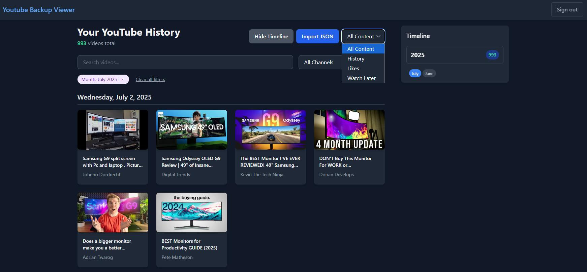

# YouTube Backup Viewer - Because YouTube Forget Everything Over 5000



A dark-themed web application for viewing and organizing your YouTube history, likes, and watch later videos. Built with React, TypeScript, Convex, and Tailwind CSS.

## Features

- **Dark Mode Interface** - Easy on the eyes with good contrast
- **Content Type Filtering** - Automatically detects and categorizes History, Likes, and Watch Later files
- **Timeline View** - Hierarchical year/month filtering with video counts
- **Advanced Search** - Search by title, filter by channel, date, and content type
- **Removed Video Tracking** - Identifies videos that have been deleted from YouTube
- **Responsive Design** - Works on desktop and mobile devices

## Getting Started

### Prerequisites

- Node.js (v18 or higher)
- npm or yarn package manager

### Installation

1. Clone the repository:

```bash
git clone <repository-url>
cd yt-backup-viewer
```

2. Install dependencies:

```bash
npm install
```

3. Set up Convex (backend):

```bash
npx convex dev
```

4. Start the development server:

```bash
npm run dev
```

5. Open [http://localhost:5173](http://localhost:5173) in your browser

## Using the History Scraper

> ⚠️ **Note**: Currently only the History Scraper is ready. Likes and Watch Later scrapers are in development.

### Step 1: Navigate to YouTube History

1. Go to [YouTube History](https://www.youtube.com/feed/history)
2. Make sure you're logged into your YouTube account
3. Ensure your history is visible (not paused)

### Step 2: Run the Scraper Script

1. Open your browser's Developer Console:

   - **Chrome/Edge**: Press `F12` or `Ctrl+Shift+I` (Windows) / `Cmd+Option+I` (Mac)
   - **Firefox**: Press `F12` or `Ctrl+Shift+K` (Windows) / `Cmd+Option+K` (Mac)
   - **Safari**: Press `Cmd+Option+I` (Mac) - you may need to enable Developer menu first

2. Go to the **Console** tab

3. Copy the entire contents of `scrapper/History-Scraper.js` and paste it into the console

4. Press **Enter** to run the script

### Step 3: Monitor the Scraping Process

- The script will automatically start scrolling through your YouTube history
- A red "STOP SCRAPER" button will appear in the top-right corner
- Progress updates will be logged to the console
- The script will automatically stop when it reaches the end of your history

### Step 4: Download Your Data

- When scraping is complete, a JSON file will automatically download
- The filename format is: `youtube-history-{count}-{date}.json`
- Example: `youtube-history-1250-2025-07-31.json`

### Step 5: Upload to the Viewer

1. Return to the YouTube Backup Viewer application
2. Click the **"Import JSON"** button
3. Select your downloaded JSON file
4. The app will automatically detect it as "History" content
5. Start exploring your YouTube history!

## Script Safety

The History Scraper script:

- ✅ Only reads data that's already visible on your YouTube history page
- ✅ Does not send data to any external servers
- ✅ Downloads data directly to your computer
- ✅ Can be stopped at any time using the stop button
- ✅ Only works on YouTube's official history page

## File Format Support

The app automatically detects content types based on filename patterns:

- **History**: Files containing "history" (e.g., `youtube-history-*.json`)
- **Likes**: Files containing "likes" or "liked" (e.g., `youtube-likes-*.json`)
- **Watch Later**: Files containing "watch-later" or "watchlater" (e.g., `youtube-watch-later-*.json`)

## Application Features

### Timeline Filtering

- **Years**: Click on any year to filter videos from that year
- **Months**: Click on month pills to filter by specific months
- **Counts**: See how many videos you watched in each time period

### Search & Filters

- **Text Search**: Search video titles in real-time
- **Channel Filter**: Filter by specific YouTube channels
- **Content Type**: Switch between History, Likes, and Watch Later
- **Removed Videos**: Toggle to show videos that have been deleted from YouTube

### Visual Elements

- **Emerald Accents**: Video counts are highlighted in emerald-400
- **Thumbnail Fallbacks**: Graceful handling of missing thumbnails
- **Loading States**: Smooth loading animations and pagination

## Development

### Project Structure

```
├── src/
│   ├── App.tsx                 # Main app component
│   ├── YouTubeHistoryViewer.tsx # Main viewer component
│   ├── SignInForm.tsx          # Authentication form
│   └── index.css               # Global dark mode styles
├── convex/
│   ├── videos.ts               # Video data queries and mutations
│   ├── schema.ts               # Database schema
│   └── auth.config.ts          # Authentication config
├── scrapper/
│   └── History-Scraper.js      # YouTube history scraper script
└── README.md                   # This file
```

### Available Scripts

- `npm run dev` - Start development server with hot reload
- `npm run build` - Build for production
- `npm run lint` - Run TypeScript and ESLint checks

### Technology Stack

- **Frontend**: React 19, TypeScript, Tailwind CSS
- **Backend**: Convex (real-time database and auth)
- **Build Tool**: Vite
- **Styling**: Tailwind CSS with custom dark theme
- **Authentication**: Convex Auth

## Roadmap

- [ ] **Likes Scraper** - Script to export YouTube liked videos
- [ ] **Watch Later Scraper** - Script to export Watch Later playlist
- [ ] **Bulk Export** - Export multiple content types at once
- [ ] **Data Analytics** - Viewing statistics and insights
- [ ] **Video Categories** - Auto-categorize videos by topic
- [ ] **Export Features** - Export filtered results to various formats

## Troubleshooting

### Common Issues

**Script doesn't work:**

- Make sure you're on the YouTube history page (`youtube.com/feed/history`)
- Ensure your browser console is open to the Console tab
- Try refreshing the page and running the script again

**No videos found:**

- Check if your YouTube history is paused
- Make sure you're logged into your YouTube account
- Some videos might be private or deleted

**File won't upload:**

- Ensure the file is a valid JSON file
- Check that the file isn't corrupted
- Try a smaller subset of your history first

### Getting Help

If you encounter issues:

1. Check the browser console for error messages
2. Ensure you're using a modern browser (Chrome, Firefox, Safari, Edge)
3. Try the script on a smaller section of your history first

## Privacy & Security

- All data processing happens locally in your browser
- No data is sent to external servers without your consent
- The Convex backend only stores data you explicitly upload
- You have full control over your data and can delete it anytime

---

**Ready to explore your YouTube history?** Start by running the History Scraper script on your YouTube history page!
